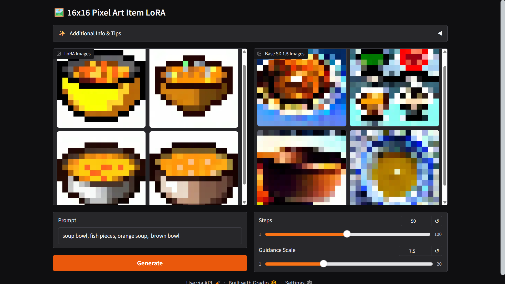

# 🖼️ 16x16 Pixel Art Items LoRA

LoRA model trained with Khoya on Stable Diffusion 1.5. The purpose of this LoRA is to generate 16 by 16 pixel game asset items. 

While items may not be perfectly created, the LoRA is sucessful in creating the 16x16 blocky pixel style. Below is an example with the LoRA on the left and SD 1.5 on the right (both scaled down to 16x16 pixels)

## Usage 

To test and generate images, use the Google Colab notebook which launches Gradio

- On the notebook, make sure to change your runtime type to a T4 GPU
- Run each code block in order and then utilize the generated Gradio link

**Prompting:**  
For best results, use a comma-separated list.  
Example: `diamond helmet, blue, weapon`

## Challenges/Limitations
- Due to the small size of the dataset, some items won't turn out well
- White items may not generate well due to training on white backgrounds

## Dataset Information

**16x16 Textures**   
From Dataset by James-A + Additional Ones   
https://huggingface.co/datasets/James-A/Minecraft-16x-Dataset

**Kyrise's Free 16x16 Icon Pack**   
Icons by Kyrise,    
Licensed under [CC BY 4](https://creativecommons.org/licenses/by/4.0/).     
https://opengameart.org/content/kyrises-free-16x16-rpg-icon-pack

**Pixel Foods (Modified)**  
Icons by Henry Software,    
Public Domain [CC0](https://creativecommons.org/publicdomain/zero/1.0/).    
https://opengameart.org/content/64-16x16-food-sprites

**Fantasy Swords**
Icons by ARoachIFoundOnMyPillow,    
Public Domain [CC0](https://creativecommons.org/publicdomain/zero/1.0/).    
https://opengameart.org/content/16x16-swords-weird

**RPG Weapons**
Icons by CapivarAzul,    
Public Domain [CC0](https://creativecommons.org/publicdomain/zero/1.0/).    
https://opengameart.org/content/simple-rpg-weapons-icon-16x16